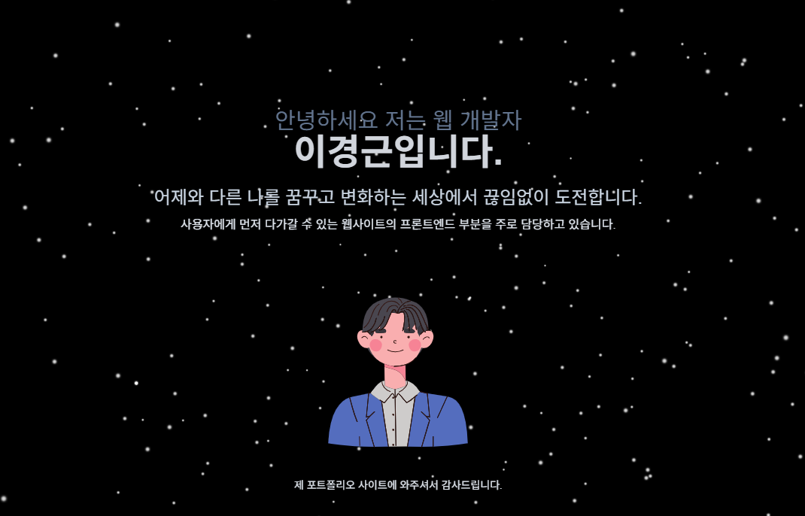

# 🧑‍💻 Portfolio - 이경근



개발자 이경근의 포트폴리오 웹사이트입니다.
개발의 시작을 빅뱅과 같이 애니메이션으로 표현하였습니다.
Next.js, TypeScript, TailwindCSS, Three.js 등을 활용해 제작하였으며
반응형 인터페이스와 인터랙티브한 UI/UX 구성에 중점을 두었습니다.

---

## 🔗 배포 주소

- 👉 [포트폴리오 보러가기](https://my-portfolio.vercel.app)

---

## 🛠 사용 기술 스택

| 기술         | 설명                             |
|--------------|----------------------------------|
| **Next.js**  | 정적/SSR 지원 React 프레임워크     |
| **React.js** | UI 컴포넌트 기반 프론트엔드 라이브러리 |
| **TypeScript** | 정적 타입을 지원하는 JavaScript 슈퍼셋 |
| **TailwindCSS** | 유틸리티 기반 CSS 프레임워크 |
| **Three.js** | 3D 애니메이션 배경 구성 |

---

## 📁 프로젝트 구조

```bash
my-portfolio/
├── public/             # 공개 이미지 및 정적 자산
├── src/
│   ├── components/     # UI 구성 컴포넌트
│   ├── pages/          # 라우팅 페이지
│   ├── styles/         # Tailwind 설정 및 전역 스타일
│   └── utils/          # (필요 시) 유틸 함수
├── .eslintrc.json      # ESLint 설정
├── tailwind.config.js  # TailwindCSS 설정
├── tsconfig.json       # TypeScript 설정
└── README.md


## Deploy on Vercel

The easiest way to deploy your Next.js app is to use the [Vercel Platform](https://vercel.com/new?utm_medium=default-template&filter=next.js&utm_source=create-next-app&utm_campaign=create-next-app-readme) from the creators of Next.js.

Check out our [Next.js deployment documentation](https://nextjs.org/docs/pages/building-your-application/deploying) for more details.
